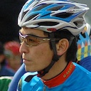

# About Mitsukuni Sato

Mitsukuni Sato (佐藤光国)

Freelance web application, iOS application developer.

Mainly work is a project manager and mobile application engineer at tsumug, inc. Tsumug making a lock hardware (We call this as TiNK) that has a network connectivity. Device has BLE and LTE networking module for controlling the device via REST API. I am using my knowledge of hardware development and web development.

## Awards

- 2018
  - Best award, Web and Car hackathon
    - AI passenger for personal assistance "Ore-yome (Wata-kare)"
- 2017
  - Sakura internet award, LINE BOT AWARD
    - Made a "Mototrack". It's a hardware and web-service. That provides to function to talk with your motorcycle.
- 2016
  - Innovation Award (Fitness, sport and biotech), CES 2016
    - World's first 3D printed roadbike with internet connectivity.

## References

- [Cerevo Inc.](http://cerevo.com)
- [DMM.com](http://www.dmm.com/)
- [DMM.make AKIBA](http://akiba.dmm-make.com)
